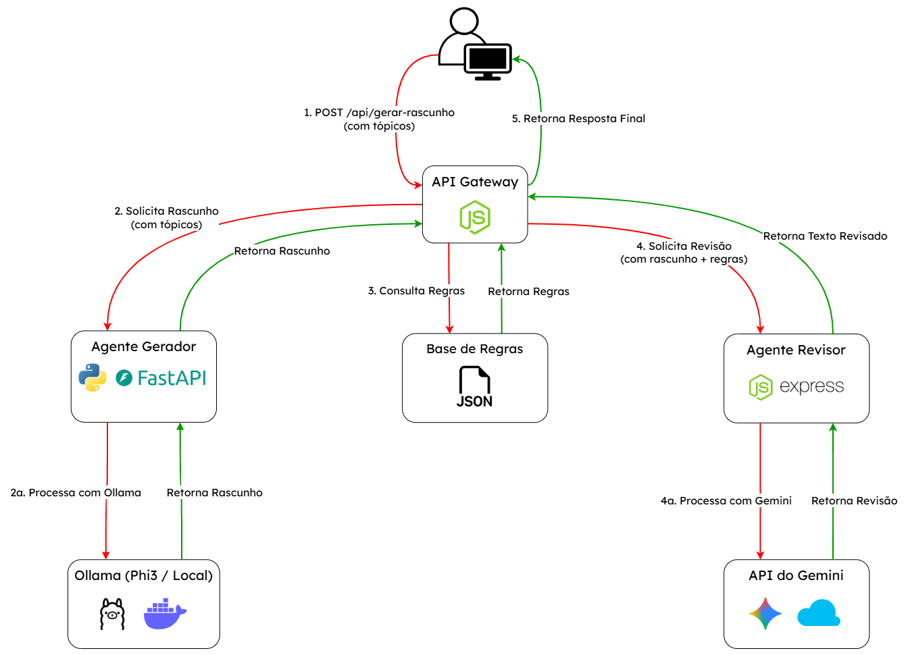
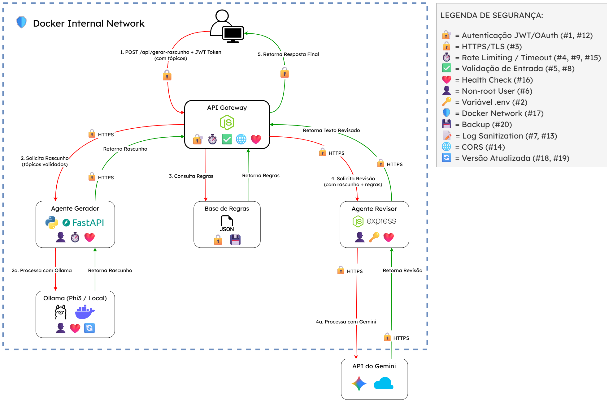

# 🧠 Assistente de Redação Distribuído — UFLA

### Projeto da disciplina **Sistemas Distribuídos** — Universidade Federal de Lavras (UFLA)

> Sistema distribuído com múltiplos agentes de IA que auxiliam na **padronização de textos e comunicações empresariais**, desenvolvido para a empresa júnior **Alfa Pública Jr**.

---

## 🧑‍💻 Desenvolvedores

- **Daniel de Jesus Moreira** - [danieLx77](https://github.com/danieLx77)
- **Hugo Dias Pontello** - [DPontello](https://github.com/DPontello)
- **João Guilherme Santos Ribeiro** - [joaogsribeiro](https://github.com/joaogsribeiro)
- **Ruan Pablo Gomes Rocha** - [FixRuan](https://github.com/FixRuan)

---

## 🎯 Objetivo

Desenvolver um sistema distribuído composto por múltiplos agentes de Inteligência Artificial capazes de:
- Gerar rascunhos de e-mails, propostas e comunicados empresariais.
- Realizar revisão automática de tom, terminologia e clareza.
- Garantir consistência e padronização da comunicação na empresa júnior **Alfa Pública Jr**.

---

## 🧪 Validação do Problema

### Identificação da Dor Junto ao Cliente

**Cliente Parceiro:** Alfa Pública Jr - Empresa Júnior da UFLA

**Metodologia de Validação:**
Durante a fase de levantamento de requisitos, realizamos uma consulta estruturada via Google Forms com a empresa para identificar as principais dores relacionadas à gestão de documentos e comunicação. A presidente da empresa priorizou a seguinte dor:

**Problema Selecionado: Padronização de Textos e Comunicações**
> "A elaboração de textos recorrentes, como e-mails de primeiro contato com clientes, minutas de propostas ou comunicados internos, pode variar em tom e qualidade. Garantir que todos sigam o padrão da empresa exige revisões manuais demoradas."

**Impactos Reportados:**
- Variação de tom e qualidade entre diferentes membros da equipe.
- Tempo excessivo gasto em revisões manuais.
- Desafio em manter consistência nas comunicações empresariais.

---

## 🧩 Arquitetura Geral

O sistema é composto por **microserviços containerizados** que se comunicam entre si via **API REST** e expõem uma API principal para integração com o usuário.

### Diagrama da Arquitetura (Visão Inicial)



**Componentes:**
- **API Gateway (Node.js/Express)** — Ponto de entrada e orquestração.
- **Agente Gerador (Python/FastAPI)** — Gera rascunhos iniciais com base em tópicos, utilizando um modelo local.
- **Agente Revisor (Node.js/Express)** — Revisa textos e aplica padronização, utilizando uma API externa.
- **Ollama (Phi-3)** — Modelo de IA local, executado em um container Docker.
- **API do Gemini** — Modelo de IA externo para tarefas de revisão complexas.
- **Base de Regras (JSON)** — Armazena as regras de padronização da empresa.

**Fluxo Simplificado:**
1. O usuário envia os tópicos para o Gateway.
2. O Gateway solicita ao Agente Gerador que crie um rascunho usando o modelo local (Ollama).
3. O Gateway busca as regras de padronização e envia o rascunho junto com as regras para o Agente Revisor.
4. O Agente Revisor utiliza a API externa (Gemini) para adequar o texto.
5. O resultado final é retornado ao usuário.

---

### Justificativa da Arquitetura Proposta

**1. Modularidade e Separação de Responsabilidades**
Cada componente do sistema tem uma função clara e isolada. O API Gateway cuida da orquestração, enquanto os agentes tratam de partes distintas do processamento do texto (geração e revisão). Essa separação facilita a manutenção, testes e evolução independente de cada serviço.

**2. Escalabilidade e Desempenho**
Ao adotar microserviços containerizados, cada agente pode ser escalado horizontalmente conforme a demanda. Por exemplo, se a geração de rascunhos for mais custosa, é possível subir múltiplas instâncias do Agente Gerador sem alterar o resto do sistema.

**3. Desacoplamento entre Serviços**
A utilização de um API Gateway como orquestrador centraliza a lógica de comunicação, permitindo que os agentes operem de forma independente, sem conhecerem uns aos outros. Isso aumenta a resiliência e reduz o risco de interrupção completa do sistema.

**4. Manutenibilidade e Evolução Tecnológica**
Como os serviços são independentes, é possível atualizar o modelo do Agente Revisor (ex.: trocar por uma versão mais recente do Gemini) ou a linguagem de um agente sem reescrever a arquitetura completa, reduzindo o custo de evolução.

---

## 🔒 Modelagem de Ameaças (STRIDE)

A análise de segurança identificou **20 ameaças** ao sistema, categorizadas pela metodologia **STRIDE** (Spoofing, Tampering, Repudiation, Information Disclosure, Denial of Service, Elevation of Privilege).

### Resumo Executivo

- **Total de ameaças identificadas:** 20
- **Redução média de risco:** ~69% (de ~45 para ~14)
- **Cobertura STRIDE:** Todas as 6 categorias contempladas
- **Ameaças críticas (Risco > 60):** 3 (IDs: 1, 2, 4)

### Distribuição por Categoria

| Categoria STRIDE | Quantidade |
|------------------|------------|
| Spoofing (Falsificação) | 3 |
| Tampering (Manipulação) | 5 |
| Repudiation (Repúdio) | 2 |
| Information Disclosure (Vazamento) | 4 |
| Denial of Service (Negação) | 5 |
| Elevation of Privilege (Escalação) | 3 |

### Documentação Completa

📄 **[Acesse a Modelagem de Ameaças Completa](./docs/modelagem_de_ameacas.md)**

A documentação completa inclui:
- Tabela detalhada das 20 ameaças identificadas
- Metodologia STRIDE aplicada
- Cálculo de risco (Probabilidade × Impacto)
- Medidas de mitigação para cada ameaça
- Análise de risco residual
- Arquivo CSV para processamento: [`modelagem_de_ameacas.csv`](./docs/modelagem_de_ameacas.csv)

---

## 🏗️ Arquitetura Final (Pós-Mitigação)

Após a análise de segurança e modelagem de ameaças, a arquitetura foi aprimorada com múltiplas camadas de proteção para mitigar as 20 ameaças identificadas.

### Diagrama da Arquitetura Final



**Principais Melhorias de Segurança Implementadas:**
- 🔐 **Autenticação JWT/OAuth** no API Gateway (mitigação #1, #12)
- 🔒 **Comunicação HTTPS/TLS** entre todos os serviços (mitigação #3)
- ⏱️ **Rate limiting e timeouts** para proteção contra DoS (mitigações #4, #9, #15)
- ✓ **Validação de entrada e sanitização** de dados (mitigações #5, #8)
- ❤️ **Health checks** em todos os containers (mitigação #16)
- 🛡️ **Isolamento via Docker Internal Network** (mitigação #17)
- 🔑 **Proteção de secrets** com variáveis de ambiente (mitigação #2)
- 📝 **Log sanitization** e logging centralizado (mitigações #7, #13)

### Impacto das Mitigações

- **Redução de risco:** ~69% (de ~45 para ~14)
- **Ameaças críticas neutralizadas:** 3 (IDs: 1, 2, 4)
- **Todas as 20 ameaças** possuem medidas de mitigação implementadas

📄 **[Acesse a Documentação Completa da Arquitetura Final](./docs/arquitetura_final.md)**

A documentação completa inclui:
- Diagrama de fluxo de dados detalhado com medidas de segurança
- Mapeamento completo de cada medida de mitigação por componente
- Comparação de risco antes vs. depois para cada ameaça
- Justificativas técnicas e referências metodológicas

---

## ⚙️ Tecnologias Utilizadas

| Categoria | Tecnologia | Propósito |
|-----------|------------|-----------|
| **Backend** | Node.js, Python | Desenvolvimento dos microsserviços |
| **Frameworks** | Express.js, FastAPI | Criação das APIs |
| **IA (Local)** | Ollama (Phi-3) | Geração de rascunhos |
| **IA (Externa)** | Google Gemini | Revisão e padronização |
| **Containerização**| Docker, Docker Compose | Empacotamento e orquestração dos serviços |
| **Comunicação** | API REST (HTTP) | Comunicação entre os microsserviços |

---

## 🚀 Como Executar o Projeto

**Pré-requisitos:**
- Docker e Docker Compose instalados.
- Arquivo `.env` na raiz do projeto com as variáveis de ambiente necessárias.

**Passos:**
1. Clone o repositório:
   ```bash
   git clone https://github.com/DPontello/writing-assistant.git
   ```
2. Navegue até a pasta do projeto:
   ```bash
   cd writing-assistant
   ```
3. Crie o arquivo `.env` na raiz do projeto com o seguinte formato:
   ```env
   GEMINI_API_KEY=SUA_CHAVE_AQUI
   LOGIN_USER=SEU_USUARIO
   LOGIN_PASS=SUA_SENHA
   JWT_SECRET=SUA_CHAVE_SECRETA
   JWT_EXPIRES=1h (RECOMENDADO)
   ```
4. Suba os containers:
   ```bash
   docker-compose up --build
   ```
5. Aguarde o download do modelo de IA (~2 minutos na primeira execução).

6. Acesse o sistema:
   - **Interface Web:** `http://localhost:3000`
   - **Página de Login:** `http://localhost:3000/login.html`
  
---

## 📚 Referências

As seguintes fontes comprovam a relevância do problema de padronização de comunicação e a validade da arquitetura de microsserviços e IA proposta para resolvê-lo:

1.  **BRASIL JÚNIOR.** Movimento Empresa Júnior - Confederação Brasileira de Empresas Juniores. Disponível em: `https://brasiljunior.org.br/conheca-o-mej`. Acesso em: 13 nov. 2025.
    > A Brasil Júnior representa mais de 500 empresas juniores no Brasil, confirmando que a Alfa Pública Jr faz parte de um ecossistema nacional que enfrenta desafios similares de padronização e profissionalização da comunicação empresarial.

2.  **GRAMMARLY.** Business Communication Solutions - AI Writing Assistant for Teams. Disponível em: `https://www.grammarly.com/business`. Acesso em: 13 nov. 2025.
    > Demonstra a demanda de mercado por ferramentas de assistência à escrita empresarial, com clientes reportando ROI de 17x e economia de $5.000 anuais por funcionário através da padronização da comunicação.

3.  **MCKINSEY & COMPANY.** The Economic Potential of Generative AI: The Next Productivity Frontier. McKinsey Global Institute, 2023. Disponível em: `https://www.mckinsey.com/capabilities/mckinsey-digital/our-insights/the-economic-potential-of-generative-ai-the-next-productivity-frontier`. Acesso em: 13 nov. 2025.
    > Estudo que identifica a assistência à escrita como uma das principais aplicações de IA generativa, com potencial de aumentar a produtividade em 20-25% em funções que envolvem comunicação empresarial.

4.  **RADICATI GROUP.** Email Statistics Report, 2023-2027. The Radicati Group, Inc., 2023.
    > Estima que 347 bilhões de e-mails são enviados diariamente no mundo, evidenciando a importância crítica da comunicação escrita nos negócios modernos.

5.  **HARVARD BUSINESS REVIEW.** The Cost of Poor Communications. Harvard Business Publishing, 2022.
    > Demonstra que empresas com mais de 100 funcionários perdem em média $420.000 por ano devido à má comunicação e falta de padronização em documentos empresariais.

6.  **FOWLER, Martin.** Microservices. 2014. Disponível em: `https://martinfowler.com/articles/microservices.html`. Acesso em: 13 nov. 2025.
    > Artigo seminal que define o padrão de arquitetura de Microsserviços, o qual foi adotado neste projeto para garantir a escalabilidade e a separação de responsabilidades entre os agentes de IA (Gerador e Revisor).

7.  **OLLAMA.** Ollama - Run LLMs Locally. Disponível em: `https://ollama.com/`. Acesso em: 13 nov. 2025.
    > Documentação da ferramenta utilizada para executar o modelo de IA local (Phi3), atendendo ao requisito do trabalho de um agente local e containerizado (Docker).


